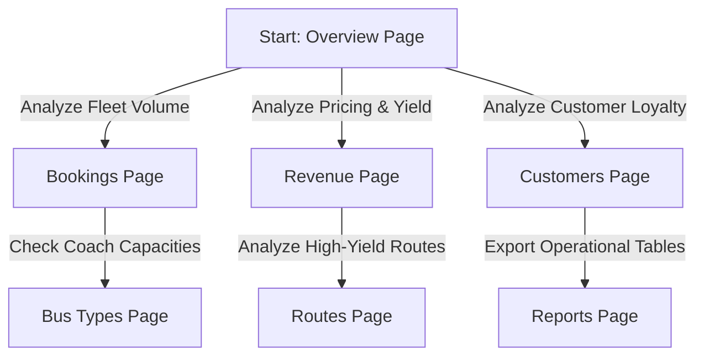

# Bus Booking Analytics - User Flow and System Steps

This document outlines the **User Flow** for interacting with the Power BI dashboards and the **Execution Steps** for setting up the relational database and running the data pipeline.

---

## 🗺️ Part 1: Dashboard User Flow

The analytical system consists of **7 interactive pages** linked via a sticky navigation sidebar. Below is the workflow for how a business analyst, route manager, or pricing executive navigates the system:

### 1. The Main Sidebar Navigation
*   **Navigation Actions**: The user uses the left-hand sidebar containing 7 icons to jump between pages. Hovering over icons triggers a sky blue highlight, and selecting a page highlights that icon as active.
*   **The Filter Overlay Pane**: Clicking the **Filters (Funnel)** button at the top right slides open a white overlay panel from the right. The user adjusts date ranges, route sources, or bus classes, then clicks the **Close (X)** button to collapse it. The charts dynamically update across all pages.

### 2. Detailed Page-by-Page User Flow



#### 📍 Page 1: Overview (High-Level Performance)
*   **User Action**: The executive checks the 4 top KPI cards (Total Bookings, Total Revenue, Avg Fare, and Customer Retention) with green/red indicator coloring vs the previous month's target.
*   **Next Step**: The user scrolls down to view the **Monthly Revenue Trend** (line chart) and **Revenue by Route** (bar chart) to see which markets are driving growth.

#### 📍 Page 2: Bookings (Operational Health)
*   **User Action**: The operations manager monitors booking status distributions (**Confirmed vs Pending vs Cancelled**).
*   **Next Step**: The user opens the **Filter Panel** to filter by specific travel dates to check if cancellations spikes correlate with specific holidays or weekend runs.

#### 📍 Page 3: Revenue (Yield Management)
*   **User Action**: The finance analyst checks the pricing yield across bus classes (e.g. comparing average sleeper ticket fares vs seater tickets).
*   **Next Step**: The user inspects the **Cumulative Revenue Trend** to verify if the company is on target to hit its quarterly sales milestones.

#### 📍 Page 4: Customers (Demographics & Profiles)
*   **User Action**: The CRM marketing team reviews customer demographics (Age Group distributions, Gender split) and repeat cohort size.
*   **Next Step**: The user checks the **Customer Retention Gauge** (against the 80% target) to determine if recent customer retention campaigns are successful.

#### 📍 Page 5: Bus Types (Asset Utilization)
*   **User Action**: The fleet dispatcher checks seating capacity vs occupied seats across AC Sleeper, Non-AC Sleeper, and AC Seater classes.
*   **Next Step**: The user scans the **Asset Yield Table** to see which individual buses have low occupancy rates (e.g. <50%) to reassign them to lower-demand routes.

#### 📍 Page 6: Routes (Corridor Demands)
*   **User Action**: The route planner analyzes the passenger traffic loads on specific corridors.
*   **Next Step**: The user compares route distance against total revenue generated to check if long-distance routes are being priced fairly.

#### 📍 Page 7: Reports (Raw Export & Details)
*   **User Action**: The auditor searches for specific booking IDs or customer names using the search bar.
*   **Next Step**: The user right-clicks on the table visual and selects **Export data** to download a clean CSV file for local spreadsheet analysis.

---

## ⚙️ Part 2: System Execution Steps (Step-by-Step)

Follow these steps to generate, cleanse, persist, and visualize the data in Power BI.

### Step 1: Initialize the Local MySQL Server
Ensure MySQL Server is running locally on your computer. Create a schema called `bus_booking_analytics`:
```sql
CREATE DATABASE IF NOT EXISTS bus_booking_analytics;
```

### Step 2: Generate the Raw Datasets
Run the Python data generator to create base entities (Customers, Buses, Routes) and synthetic raw bookings. The generator automatically injects anomalies (missing fares, out-of-capacity seats, duplicates, and inconsistent date formats) for validation testing:
```bash
python data_generation/data_generator.py
```
*   **Input**: Random seeds and configurations.
*   **Output**: 4 raw CSV files stored in `data/` (`bus_booking_raw.csv`, `customers.csv`, `buses.csv`, `routes.csv`).

### Step 3: Run the ETL and Load Database
Run the ETL pipeline script. It parses date strings, deduplicates bookings, drops records with missing fares, caps customer bookings to under 75 max to keep metrics realistic, and loads the cleaned data into MySQL:
```bash
python etl_pipeline/etl_pipeline.py --user root --password YOUR_MYSQL_PASSWORD
```
*   **Input**: Raw CSV files from `data/`.
*   **Process**: Cleans date formats to `YYYY-MM-DD`, standardizes casing, and validates relational constraints.
*   **Output**: 
    *   Cleaned CSVs saved in `data/clean/`.
    *   Fully structured, cleaned tables pushed directly into your local MySQL database.

### Step 4: Open and Connect Power BI
1. Launch Power BI Desktop and open the project template file: **`Bus Booking Analytics System.pbix`**.
2. Click **Transform Data** in the Home ribbon to open Power Query.
3. Select **Data Source Settings** and update the local MySQL Connection:
   *   Server: `localhost`
   *   Database: `bus_booking_analytics`
   *   Username: `root`
   *   Password: `YOUR_MYSQL_PASSWORD`
4. Click **Close & Apply** to pull the newly generated, cleaned records into your report charts!
