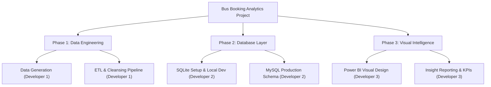
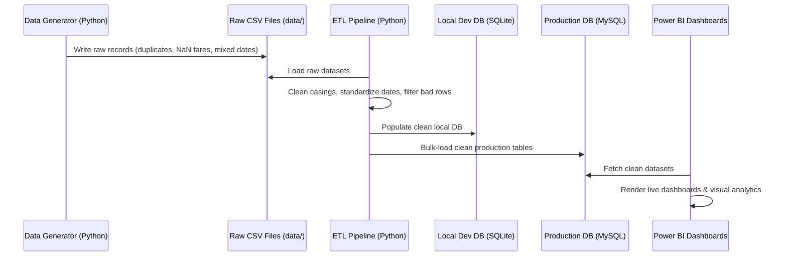

# Work Structure & Workflow

This document outlines the **Work Breakdown Structure (WBS)** and system workflows for the 3-member team. It coordinates development across the Data Generation, ETL Pipeline, and Visualization phases.

---

## Work Breakdown Structure (WBS)

### 1. Phase 1: Data Engineering
- **Task 1.1: Data Ingestion Setup**: Create robust python script to load dirty raw data CSVs.
- **Task 1.2: Formatting & Parsing**: Implement mixed-date string formatting parser, lower/upper casing, and validation check scripts.
- **Task 1.3: Verification Logs**: Create logging reporting systems to list rows dropped for anomalies.

### 2. Phase 2: Database Layer
- **Task 2.1: Relational Schema DDL**: Create SQL schemas for Customers, Buses, Routes, and Bookings.
- **Task 2.2: Relational Persistence Loaders**: Implement python function to bulk-insert clean pandas DataFrames into SQL tables.

### 3. Phase 3: Visual Intelligence
- **Task 3.1: Power BI Data Model**: Import SQL tables into Power BI. Connect relationships (Customers 1->M Bookings, Buses 1->M Bookings, Routes 1->M Bookings).
- **Task 3.2: Dashboard Visuals**:
  - Total Revenue, Total Bookings KPI blocks.
  - Booking trends line charts.
  - Customer distribution maps.
  - Seat occupancy rate gauges.

---

## Project Workflow
Our development follows a structured ETL data pipeline flow:

