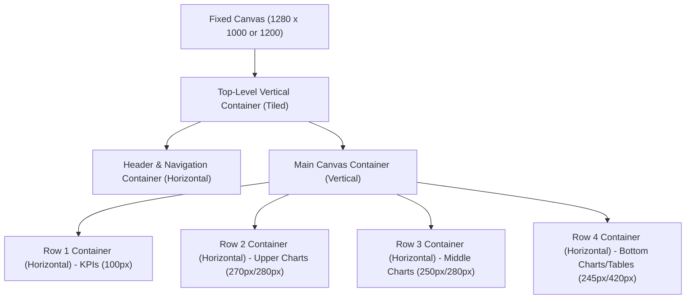

# Dashboard Layout, Containers & Typography Design Guide (Tableau Version)

This beginner-friendly guide outlines the canvas settings, visual container hierarchies, sizing coordinates, and formatting workflows required to construct the single-page **Bus Booking Dashboard** in Tableau Desktop.

---

## 1. Canvas & Sizing Setup

Before dragging any charts, you must configure your dashboard page canvas. This prevents Tableau from automatically resizing objects and breaking the design when viewed on different screen sizes.

### Step 1: Set a Fixed Canvas Size
1. Open your Tableau workbook and click the **New Dashboard** icon at the bottom of the screen (the window icon with a plus sign).
2. Look at the left sidebar under the **Dashboard** tab.
3. Locate the **Size** dropdown menu.
4. Click the dropdown and change the setting from **Range** (or **Automatic**) to **Fixed size**.
5. Set the dimensions to:
   - **Width**: `1280` pixels
   - **Height**: `720` pixels
   - *(This represents the standard Widescreen 16:9 aspect ratio).*

### Step 2: Format the Canvas Background Color
1. In the top application menu bar, go to **Format** > select **Dashboard...**
2. A **Format Dashboard** pane will open on the left sidebar.
3. Locate the **Dashboard Shading** option and click the dropdown arrow.
4. Select **More Colors...** and enter the following hex code: **`#054A75`** (a very light frost gray).
5. Click **OK**. This background shade acts as a canvas drop-off, letting your white visual cards pop out cleanly.

---

## 2. Core Concepts for Beginners

Tableau dashboards are constructed using two main layout states: **Tiled** and **Floating**, which are managed via **Layout Containers**.

### A. Tiled vs. Floating Objects
- **Tiled (Recommended for Grid)**: Tiled objects automatically snap to fit the available space, packing together like bricks. This creates a clean grid that scales perfectly when resized.
- **Floating (For Overlays)**: Floating objects hover on top of the grid at exact pixel coordinates. We use floating objects *only* for the sliding filter overlay panel and sparkline background graphics.
- **How to toggle**: At the bottom of the left-hand **Dashboard** pane, you will see a toggle labeled **Objects** with options: **Tiled** and **Floating**. Select your target state *before* dragging an object.

### B. Horizontal vs. Vertical Layout Containers
Layout containers force nested elements to stack automatically in a specific direction.
- **Vertical Container (`[=]`)**: Stacks objects from top to bottom.
- **Horizontal Container (`[||]`)**: Positions objects side-by-side from left to right.

---

## 3. Step-by-Step Layout Container Construction

> [!IMPORTANT]
> **Tableau Sheet-First Workflow**: Before starting dashboard construction, make sure you have already built all required worksheets (sheets) as individual tabs. Layout containers on the dashboard are designed to house these sheets; you cannot build charts directly inside the containers. Create your worksheets first, then use this layout guide to assemble them.

Follow this sequence to construct the layout container hierarchy from scratch:

### Step 1: Create the Top-Level Container
1. Ensure the **Tiled** option is checked in the left Dashboard pane.
2. Drag a **Vertical Layout Container** from the Objects list and drop it onto the empty canvas. It will fill the entire screen.

### Step 2: Insert the Header Navigation Bar
1. Drag a **Horizontal Layout Container** from the objects list.
2. Drop it at the very top of your Vertical Container. Look for a blue highlighting box that fills the top section of the screen before releasing.
3. Click the outer border of this new container. In the left-hand sidebar, switch to the **Layout** tab.
4. Under the **Size** panel, check **Edit Height** and set it to **`60`** pixels.

### Step 3: Insert the Main Content Area
1. Drag another **Vertical Layout Container** and drop it *below* the header container (in the remaining large blue highlighted area).
2. This container will occupy the remaining `660px` of canvas height.

### Step 4: Drop Row Containers inside the Main Content Area
Drag and drop **Horizontal Containers** inside your Main Content Area vertical stack to define your layout rows:
1. Drag a **Horizontal Layout Container** and drop it inside the Main Content Area. This will be **Row 1** (KPI row). Edit its height to **`85`** pixels (or `100` pixels for the Overview sparkline cards).
2. Drag a second **Horizontal Layout Container** and drop it *below* Row 1. This will be **Row 2** (Upper charts). Edit its height to **`250`** pixels.
3. Drag a third **Horizontal Layout Container** and drop it *below* Row 2. This will be **Row 3** (Lower details). It will automatically fill the remaining height.

---

## 4. Formatting and Card Styles

To make your worksheets look like modern "cards" (with clean white backgrounds, borders, and shadows):

### Step 1: Select the Layout Tab
Always format objects using the **Layout** pane on the left sidebar. Click any sheet or container on the dashboard, then click the **Layout** tab on the left.

### Step 2: Configure Borders and Backgrounds
For every visual sheet (chart card) on your dashboard, apply the following properties:
1. **Background**: Click the dropdown and select white **`#FFFFFF`**.
2. **Border**: Click the border dropdown, select a solid line, and choose a light gray border (Hex **`#E2E8F0`**).
3. **Outer Padding**: Set the outer padding of every card to **`8px`** or **`10px`** on all sides. This padding creates the empty frost-gray spacing between the cards.

### Step 3: Build the Floating Filter Overlay Panel
1. Click the **Floating** toggle at the bottom of the left Dashboard tab.
2. Drag a **Vertical Layout Container** and drop it anywhere on the canvas.
3. Select this new floating container, go to the **Layout** tab on the left, and enter the following coordinates:
   - **X**: `1030`
   - **Y**: `0`
   - **Width**: `250`
   - **Height**: `720`
4. Set its **Background** to White (`#FFFFFF`). Set its **Border** to None, and add a drop shadow by selecting **Outer Border Settings** > **Drop Shadow**.
5. Drag your filter controls (checkboxes, sliders) directly into this container.

---

## 5. Page-by-Page Layout Grid Sizing

Configure the container heights and column widths inside the Main Content Area depending on the page:

### A. Overview Dashboard
- **Row 1 (KPIs)**: Height = `100px`. Contains 4 cards (Total Revenue, Total Bookings, Average Fare, Customer Retention Rate).
- **Row 2 (Upper)**: Height = `270px`. Contains:
  - Dual-Axis Month Trend (Line Chart): Fixed Width = `780px`.
  - Total Revenue by Bus_Type (Donut Chart): Fills remaining `440px`.
- **Row 3 (Lower)**: Height = `245px`. Contains:
  - Total Revenue by Source (Horizontal Bar): Fixed Width = `700px`.
  - Booking Status Cards Container (Clipboard Cards): Fills remaining `520px`.

### B. Bookings Dashboard
- **Row 1 (KPIs)**: Height = `85px`. Contains 4 KPI cards.
- **Row 2 (Upper)**: Height = `250px`. Contains:
  - Bookings by Lead Time Group (Donut): Fixed Width = `300px`.
  - Bookings by Booking_Status (Column): Fixed Width = `320px`.
  - Bookings by Month Name (Area): Fills remaining `600px`.
- **Row 3 (Lower)**: Height = `275px`. Contains:
  - Bookings by Source (Horizontal Bar): Fixed Width = `620px`.
  - Booking Status Crosstab Table: Fills remaining `600px`.

### C. Revenue Dashboard
- **Row 1 (KPIs)**: Height = `85px`. Contains 4 KPI cards.
- **Row 2 (Upper)**: Height = `250px`. Contains:
  - Total Revenue by Year Month (Area): Fixed Width = `740px`.
  - Average Seat Fare by Bus Type (Horizontal Bar): Fills remaining `480px`.
- **Row 3 (Lower)**: Height = `275px`. Contains:
  - Total Revenue by Bus Type (Pie): Fixed Width = `460px`.
  - Revenue Yield by Distance (Combo/Columns): Fills remaining `760px`.

### D. Customers Dashboard
- **Row 1 (KPIs)**: Height = `85px`. Contains 4 KPI cards.
- **Row 2 (Upper)**: Height = `250px`. Contains:
  - Customer Leaderboard (Table): Fixed Width = `740px`.
  - Unique Customers by Month Name (Area): Fills remaining `480px`.
- **Row 3 (Lower)**: Height = `275px`. Contains:
  - Bookings by Gender & Age Group (Clustered Horizontal Bar): Fixed Width = `440px`.
  - Customer Retention Rate (Semicircle Gauge): Fixed Width = `390px`.
  - Unique Customers by Age Group (Columns): Fills remaining `390px`.

### E. Bus Types Dashboard
- **Row 1 (KPIs)**: Height = `85px`. Contains 4 KPI cards.
- **Row 2 (Upper)**: Height = `230px`. Contains:
  - Count of Buses by Bus_Type (Pie): Fixed Width = `390px`.
  - Occupancy Rate (Semicircle Donut Gauge): Fixed Width = `430px`.
  - Bookings by Bus_Type (Donut): Fills remaining `390px`.
- **Row 3 (Lower)**: Height = `280px`. Contains:
  - Asset Yield Detail Table: Fixed Width = `750px`.
  - Seating Capacity vs Occupied Seats (Clustered Column): Fills remaining `460px`.

### F. Routes Dashboard
- **Row 1 (KPIs)**: Height = `85px`. Contains 4 KPI cards.
- **Row 2 (Upper)**: Height = `250px`. Contains:
  - Route Performance Matrix (Crosstab): Fixed Width = `780px`.
  - Occupancy Rate by Distance (Columns): Fills remaining `440px`.
- **Row 3 (Lower)**: Height = `275px`. Contains:
  - Bookings by Source (Donut): Fixed Width = `400px`.
  - Revenue by Route ID (Horizontal Bar): Fills remaining `820px`.

---

## 6. Color Palette & Theming (Nordic Ocean)

Apply these hex codes across the visual sheets and fonts to establish the premium theme:

| Theme Token | Hex Code | Purpose / Application |
| :--- | :--- | :--- |
| **Frost Canvas** | `#F8FAFC` | Dashboard canvas background |
| **White Card** | `#FFFFFF` | Visual card backgrounds |
| **Deep Marine Blue** | `#0F172A` | Main headers, text, and active navigation text |
| **Slate Gray** | `#64748B` | Inactive text, labels, and axis headers |
| **Light Gray** | `#E2E8F0` | Card borders and unoccupied gauge segments |
| **Arctic Cyan** | `#06B6D4` | Primary visual accents, occupied bar splits, area fills |
| **Ocean Blue** | `#054A75` | Primary lines, pie/donut charts, and active markers |
| **Teal** | `#0D9488` | Confirmed transaction state highlights |
| **Amber** | `#F59E0B` | Pending transaction state highlights |
| **Rose Red** | `#EF4444` | Cancelled transaction state highlights |
